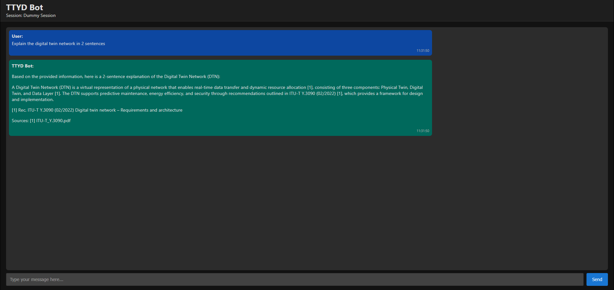

# 🗣️ Talk to Your Data (TTYD)

**AI-Powered Local Chatbot for Secure & Private Data Querying**

## 🚀 Motivation

**Talk to Your Data (TTYD)** is an **AI-powered chatbot** that allows you to interact with your own documents locally, without relying on external APIs. Unlike cloud-based AI models that expose your sensitive data to third parties, TTYD processes **everything on your machine**, ensuring **maximum privacy and security**.

### 🔒 Why Local AI?

- ✅ **Domain-Specific Accuracy** – Fine-tuned for your own knowledge base with minimal risk of hallucination.

- ✅ **Full Data Privacy** – Your data **never leaves** your machine.

- ✅ **Customizable AI** – Tune AI parameters to fit your needs.

- ✅ **Works Offline** – No internet dependency.

- ✅ **Cites Its Sources** – Ensures responses are trustworthy and reduces hallucinations.

TTYD is ideal for **researchers, businesses, and privacy-conscious users** who want **secure, local AI-driven document querying**. 🧠💡

---

## 🏗️ How It Works

TTYD combines **retrieval-augmented generation (RAG)** with hybrid search techniques:

- 1️⃣ **Document Ingestion** – It processes PDFs, Word, Excel, and JSON files, chunking them into smaller pieces.
- 2️⃣ **Hybrid Search Engine** – Uses **Weaviate search** for accurate information retrieval.
- 3️⃣ **AI Answering** – The retrieved context is passed to a **containerized Ollama model** (e.g., Llama 3) for response generation.
- 4️⃣ **Maintain History** – Remembers conversation history to provide context-aware replies.

---

## 🛠️ Prerequisites

### 🖥️ **For Windows Users**
- Install **[Docker Desktop](https://www.docker.com/products/docker-desktop/)**
- Ensure **WSL 2 backend** is enabled (recommended for performance)
- Make sure **Linux Containers** are enabled

### 🐧 **For Linux Users**
- Install **Docker Engine** ([Guide](https://docs.docker.com/engine/install/))
- Install **Docker Compose** ([Guide](https://docs.docker.com/compose/install/))

📌 **TTYD automatically detects your environment (GPU/CPU) and optimizes accordingly.**

---

## 🚀 Installation & Running

### 1️⃣ **Clone the Repository**
```sh
git clone https://github.com/ramikhaldi/TTYD
cd TTYD
# To Enable Agentic AI, pull the submodule and enable AgentMe (See .env file and refer to the AgentMe documentation: https://github.com/ramikhaldi/AgentMe):
git submodule update --init --recursive
```

### 2️⃣ **Run TTYD**

#### 🔹 **On Windows**
```sh
start.bat
#start AgentMe (in case if agentic ai is enabled)
cd external\AgentMe
start.bat
```

#### 🔹 **On Linux/macOS**
```sh
./start.sh
#start AgentMe (in case if agentic ai is enabled)
cd external\AgentMe
start.sh
```

This **automatically performs a comprehensive sanity check**, verifying:
- ✅ **Docker & Docker Compose**
- ✅ **NVIDIA GPU support & containerization**

If any issue is detected, the script will provide **clear guidance on how to fix it**.

If you want TTYD to **be installed & automatically start on boot**, run the installation script:

```sh
$ chmod +x install_service.sh
$ ./install_service.sh
```

Once installed, you can check the service status:

```sh
$ sudo systemctl status ttyd
```

To **uninstall the service**, run:

```sh
$ chmod +x uninstall_service.sh
$ ./uninstall_service.sh
```

---

## ⚡ User Interface

TTYD supports **HTTP/2** for **real-time streaming** responses. To fully leverage streaming, disable client-side buffering in e.g., cURL:

```sh
curl -N -X POST "http://host.docker.internal:5000/ask" -H "Content-Type: application/json" -d '{"question": "Summarize my files."}'
```

🖥️ TTYD UI Screenshot

Once TTYD is up and running, open your browser and navigate to http://host.docker.internal:5001 (by default) to access the TTYD interface. Below is a sample screenshot of the web UI, where you can type your questions, view chat context, and receive streamed AI-powered answers in real-time:




---

## ⚙️ Configurable Parameters

TTYD allows **fine-tuning** via **environment variables** in the `.env` file.

| Parameter                     | Default Value      | Description                                                             |
| ------------------------------| ------------------ | ----------------------------------------------------------------------- |
| `TTYD_UI_PORT`                | `5001`             | TTYD UI Port Number                                                     |
| `TTYD_API_PORT`               | `5000`             | TTYD Service Port Number                                                |
| `OLLAMA_TEMPERATURE`          | `0.5`              | Adjusts response creativity (0 = deterministic, 1+ = diverse)           |
| `WEAVIATE_ALPHA`              | `0.5`              | Hybrid search weight (0 = BM25 only, 1 = vector search only)            |
| `MODEL_NAME`                  | `llama3.2:3b`      | Local AI model used by Ollama                                           |
| `LOCAL_MODEL_NAME`            | `all-MiniLM-L6-v2` | Sentence Transformer model for vector search                            |
| `LAST_N_CONVERSATION_TURNS`   | `5`                | Number of last conversation turns the chatbot should remember           |
| `TTYD_AGENTME_ENABLED`        | `0`                | Agentic AI Enabled                                                      |
| `AGENTME_API_URL`             | `See .env file`    | Agentic AI API URL                                                      |

🔹 Adjust these in `.env`

🔹 The `instructions.txt` file can be adapted to fit your specific needs.

---

## 📝 File Support

TTYD processes the following document types:

- 📄 **PDF** (`.pdf`)
- 📝 **Word Docs** (`.docx`)
- 📊 **Excel Sheets** (`.xlsx`)
- 📜 **JSON Files** (`.json`)
- 📈 **PowerPoint** (`.pptx, .ppt`)

To use your own files, **place them in** `my_files/` **before starting TTYD.**

---

## 🔬 Advanced Features

- **Multi-Document Querying** – Ask questions across multiple files.
- **Weaviate Hybrid Search** – Combines **semantic search (AI-based)** and **keyword search (BM25)**.
- **Ollama AI Customization** – Easily swap models (Llama, DeepSeek, Mistral, Gemma, etc.).
- **Live Streaming Responses** – Faster interactions via **FastAPI Streaming API**.
- **Domain-Specific Accuracy** – Tailor AI to your knowledge base with **minimal hallucination risk**.
- **GPU Acceleration Support** – **Automatically detects and enables GPU support** (if available).
- **Comprehensive Sanity Check** – Before starting, all dependencies are validated.

---

## 🛠️ Development & Contribution

TTYD is **open-source**, and contributions are welcome! 🎉

### 🔨 **Local Development**

1. Fork & clone the repo.
2. Modify/extend/Improve.
3. Run, Test, and benchmark.
4. Submit a pull request. 🚀

---

## 💡 Future Roadmap

✅ Support more document types

✅ Enhance chunking

✅ Any Suggestions?

**Enjoy private AI-powered document chat! 🏆**
